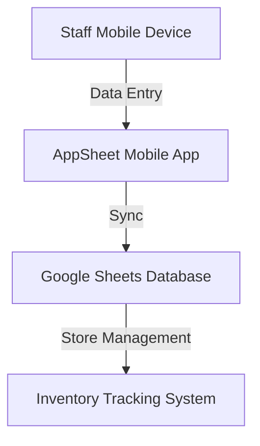
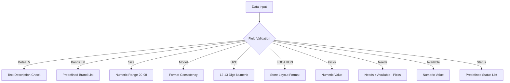

# RetailSync Architecture Documentation

## System Overview
RetailSync is a manual inventory tracking solution designed to bridge the gap between physical shelf inventory and digital record-keeping in retail environments.

## Technical Components

### 1. Frontend Application
- **Platform**: AppSheet Mobile Application
- **Primary Functions**:
  - User interface for inventory tracking
  - Mobile-friendly data entry
  - UPC scanning and manual input
  - Location-based inventory management

### 2. Backend Database
- **Platform**: Google Sheets
- **Data Storage Structure**:
  - Product Information
  - Inventory Locations
  - Stock Levels
  - Update Timestamps

## Data Flow

### Workflow Process
1. Staff Opens AppSheet App
2. Select Inventory Update Mode
3. Scan or Enter UPC Code
4. Verify/Update Product Details
5. Select Specific Store Location
6. Submit Data to Google Sheets

## Technical Architecture Diagram

### Inventory Tracking Field Definitions

- **Field Breakdown Detail**

  - **TV Purpose**: Detailed description or additional information about the TV  
    **Potential Content**: Product specifications, special features, unique identifiers, bands.
  
  - **TV Purpose (Brand)**: Likely refers to the brand of the television  
    **Examples**: Hisense, Samsung, LG, Sony.
  
  - **Size Purpose**: Screen size of the television  
    **Format**: Typically in inches  
    **Examples**: 40", 55", 65".
  
  - **Model Purpose**: Specific model number or name  
    **Examples**: Full HD, Roku H4, 4K Smart TV, OLED, Series X.
  
  - **UPC Purpose**: Universal Product Code  
    **Use**: Unique product identifier  
    **Format**: 12-13 digit numeric code.
  
  - **LOCATION Purpose**: Physical location in the store  
    **Format**: Aisle identifier, shelf number, store section.
  
  - **Picks Purpose**: Potentially tracking priority or recommended items  
    **Possible Uses**: Sales priority, featured items, recommended products.
  
  - **Needs Purpose**: Identifying specific requirements or actions  
    **Potential Interpretations**: Restocking needs.
  
  - **Available Purpose**: Inventory availability spot  
    **Values**: Number of items that can be fit into spot.
  
  - **Status Purpose**: Overall product status  
    **Possible Values**: Active, Discontinued.

